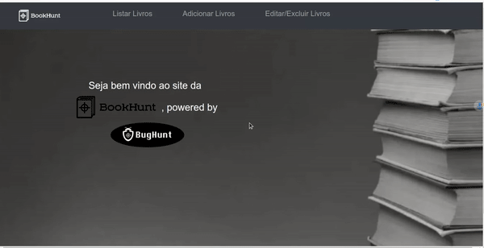

  

### Seja bem vindo ao repositório do projeto BookHunt
###  Como funciona:
#### Abre seu terminal e baixe essa aplicação com o comando:
#### git clone https://github.com/adrianoforcellini/BugHunt.git 
#### Entre na pasta do projeto, instale as dependências e inicie seu servidor com o comando:
###  cd BugHunt && npm i && npm run dev                        

## Agora basta acessar http://localhost:8080/ ;D
### ( Por padrão,o Vue executará a aplicação nesta porta, mas se ela estiver ocupada ele escolherá outra.)
### Por via das dúvidas, basta verificar o output do terminal:
  

